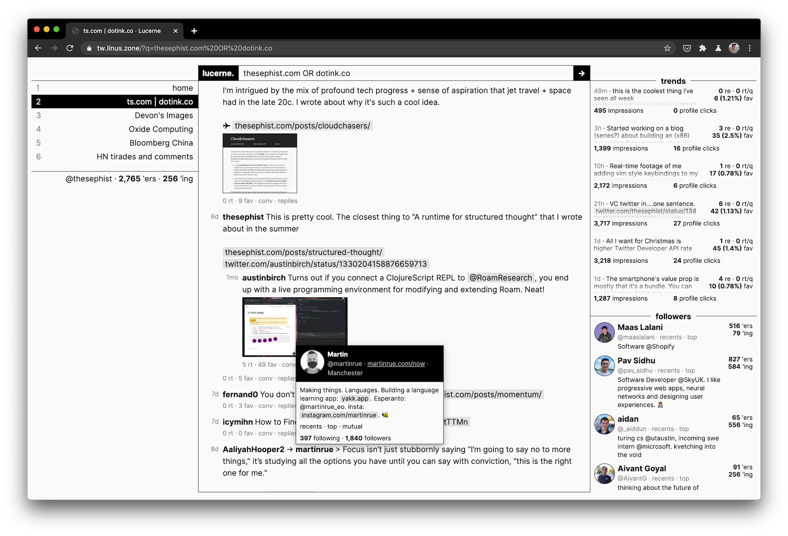
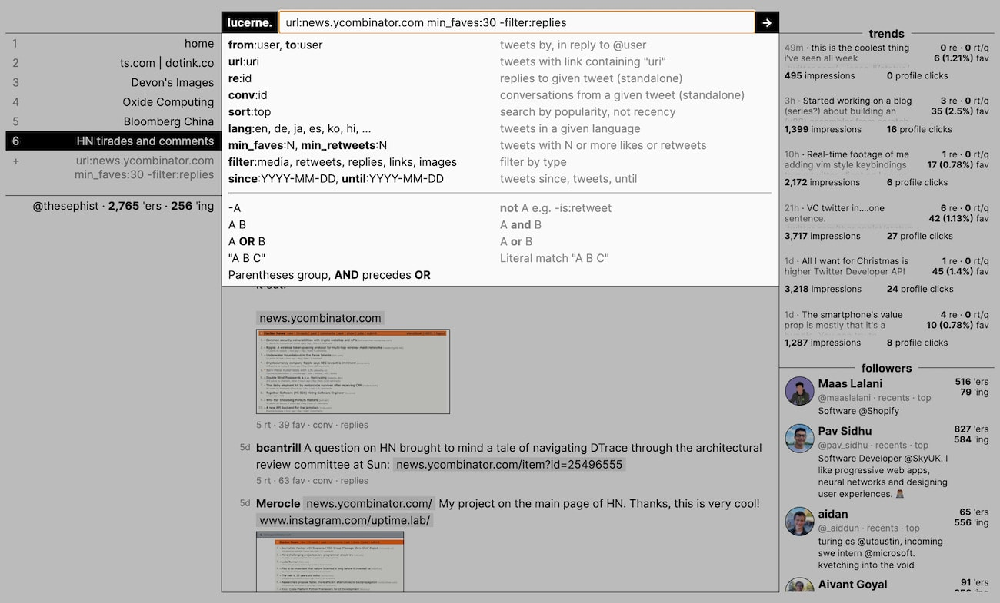

# Lucerne 🏔

**Lucerne** (named after the Swiss city) is a Twitter reader designed to amplify my personal Twitter [workflows](https://thesephist.com/posts/tools/). Lucerne is built on my usual homebrew stack, with [Ink](https://dotink.co/) on the backend and [Torus](https://github.com/thesephist/torus) on the browser. You can read more about Lucerne [on my blog](https://thesephist.com/posts/lucerne/).



Lucerne is built around a new concept called **channels**. Channels are search filters over all of Twitter that can be pinned to the sidebar, so you can switch between them quickly and easily to "tune in" to different parts of the Twittersphere. Channels can filter to specific threads, tweeters, conversations, types of media, keywords, and engagement metrics, providing a powerful primitive that can be used to build a lot of higher level use cases for channels. Built-in actions like seeing another user's tweets or searching by hashtag also take advantage of the core filter pattern. (e.g. clicking on a profile searches for `from:the_user`)

Twitter and Tweetdeck have built-in search and timeline features that are similar, but UX of experimenting with filters and immediately saving the good ones to a growing list is what really makes Lucerne fun to use, and that isn't possible in existing clients.

## Design

I think [tools should start simple and grow with use](https://thesephist.com/posts/ivy/). Lucerne is designed around a single idea, filtered channels, with other peripheral information I frequently check on Twitter displayed on the side for reference.

In addition to the headline **channels** feature, Lucerne has a few other niceties designed around the way I use Twitter, as a place for finding new ideas and sharing what I'm working on with the public.

Lucerne is designed as a better Twitter experience, but isn't designed as a complete replacement. Where Twitter.com can provide a better experience (for authoring tweets, interacting with threads, etc.) either due to API support or edge cases, Lucerne links out to Twitter's web client.

It goes without saying, because the product is designed to _help me get the most out of Twitter_ rather than make me stay on Twitter to consume ads, it feels much cleaner, more focused, and pleasant to use.

### Search

Lucerne allows you tu search twitter with a `pattern:filter` style syntax. Most of this borrows from Twitter's v1.1 search API queries, except a few that are custom and pre-processed on the backend, like `re:tweet_id` for replies to a tweet or `sort:top` to sort by top rather than recency.



I like a textual syntax for advanced searches over a bunch of toggles in the UI, since text queries can be copy-pasted, easily saved for later, and edited quickly on the keyboard. Using this particular syntax confers two advantages:

1. The syntax is also mostly usable on Twitter's web client search page, which is nice when I'm using that instead of Lucerne.
2. It keeps the implementation simple, since I pass the query (mostly) transparently through to Twitter's API endpoint.

### Account and Tweet metrics

I usually share updates to projects I'm working on or my blog posts daily on Twitter, and like to keep track of how those tweets are doing with engagement. This use case gets a panel on the right side.

My own stats -- follower and following counts -- are there because I like keeping track of it, but I need to check it at most once a couple days, and it's not important. So it gets a small footnote on the left side below the channels.

### Recent followers

Below the engagement metrics panel, there's a list of new followers in reverse-chronological order, so I can see if there's anyone interesting who recently found me on the platform. I can see if anyone has a big presence on Twitter and one-click switch to viewing their recent or popular tweets.

## How it works

Lucerne's backend is written purely in [Ink](https://dotink.co). Lucerne reuses server and routing libraries from other Ink projects, but implements custom implementations of the SHA1 HMAC algorithm and OAuth 1.1 signature algorithm, both available in `lib/`. These are used to communicate with Twitter's API without relying on a third-party implementation.

_(Is rolling your own crypto like this smart? Probably not. But this is a toy project, and I'm the only one who uses it.)_

The frontend is written as a single page [Torus](https://github.com/thesephist/torus) application, with no other dependencies. This keeps the page fast and responsive, even on slower connections and devices.

### Development

At the moment, Lucerne is designed as a single-user application: a single server can only serve _one logged-in Twitter account_. To run your own Lucerne server, create a `credentials.ink` file in the root of the repository, with the following keys. You should be able to find these credentials when you [register a Twitter developer account](https://developer.twitter.com/).

```
UserID := '<Your Twitter account's user ID, which should be a number>'
ConsumerKey := '<Your developer account's consumer public key>'
ConsumerSecret := '<Your developer account's consumer secret key>'
BearerToken := '<Your developer account's Bearer Token>'
OAuthToken := '<Your account's OAuth token>'
OAuthSecret := '<Your account's OAuth secret>'
```

With the file present, run `ink main.ink` to start the server, running on `localhost:7238/`. (To do this, you need to have [Ink installed](https://dotink.co/docs/overview/#setup-and-installation).)

Lucerne uses GNU Make for development scripts.

- `make` or `make run` starts an auto-restarting development server that restarts when any relevant files are changed.
- `make fmt` or `make f` auto-formats all Ink files with [inkfmt](https://github.com/thesephist/inkfmt). You need to have inkfmt installed on the system for this to work.

### Deploy

Lucerne runs on the hard-coded port 7238 when you run `ink main.ink` in the root directory of the project. To do this in deployment, I define Lucerne as a systemd service with [`lucerne.service`](lucerne.service) and let systemd manage the server. If you want to try deploying Lucerne yourself, make sure you have a valid `credentials.ink` from above and you're invoking ink from the correct working directory.

